# Threat Hunting Investigation Report

## Executive Summary

A threat hunting investigation was conducted against Windows telemetry collected in Splunk. Analysis identified a PowerShell Empire attack on WORKSTATION6 involving encoded PowerShell execution, Invoke-PsExec activity, AMSI bypass attempts, malicious service installation, registry-based persistence, and suspicious network communication.

The investigation reconstructed the attacker timeline using Sysmon and PowerShell logs and mapped observed behaviors to the MITRE ATT&CK framework.

---

## Environment

| Component | Value |
|------------|---------|
| SIEM | Splunk |
| Data Source | Sysmon |
| Host Investigated | WORKSTATION6.theshire.local |
| Dataset Type | Windows Telemetry |
| Investigation Method | Threat Hunting |

---

# Investigation Process

## 1. Data Ingestion Validation

Validated successful ingestion of Windows telemetry into Splunk.

Evidence:

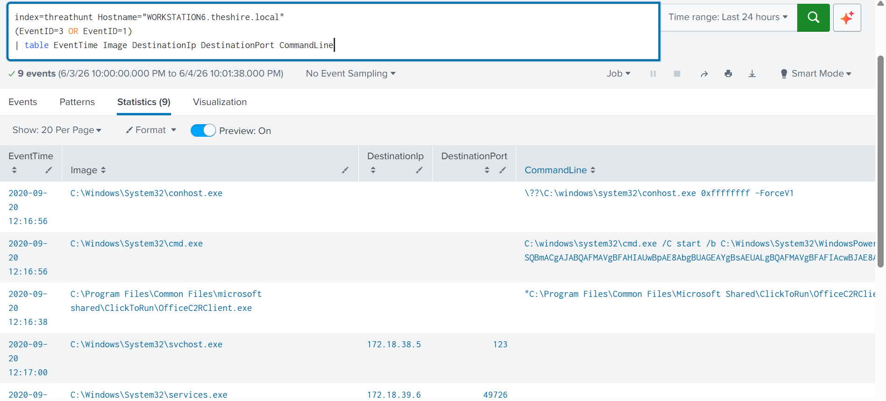

Finding:

Telemetry from multiple systems was successfully indexed and searchable.

---

## 2. Event Frequency Analysis

Event frequency analysis was performed to identify suspicious activity concentrations.

Evidence:

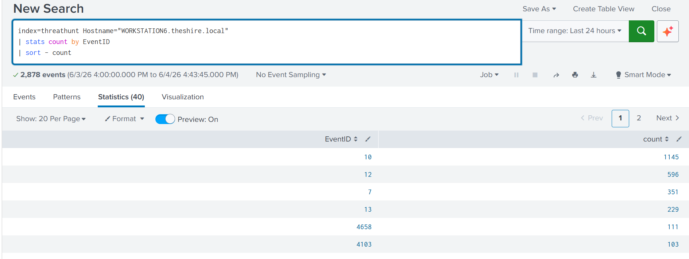

Finding:

WORKSTATION6 contained the highest volume of relevant events and was selected for deeper investigation.

---

## 3. Timeline Reconstruction

A chronological reconstruction of attacker activity was created.

Evidence:

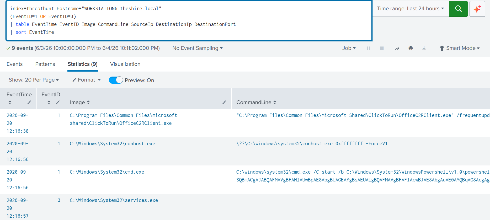

Finding:

The attack sequence revealed execution, persistence, and post-exploitation activity occurring within minutes.

---

## 4. Process Lineage Investigation

Process creation events were reviewed.

Evidence:

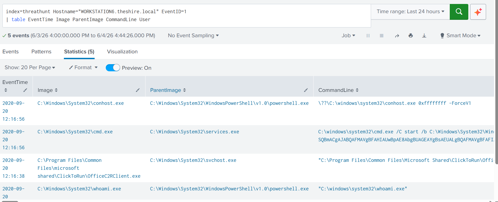

Finding:

PowerShell execution originated from suspicious parent-child process relationships.

MITRE ATT&CK:

- T1059.001 – PowerShell

---

## 5. Invoke-PsExec Detection

PowerShell logs identified execution of Invoke-PsExec.

Evidence:

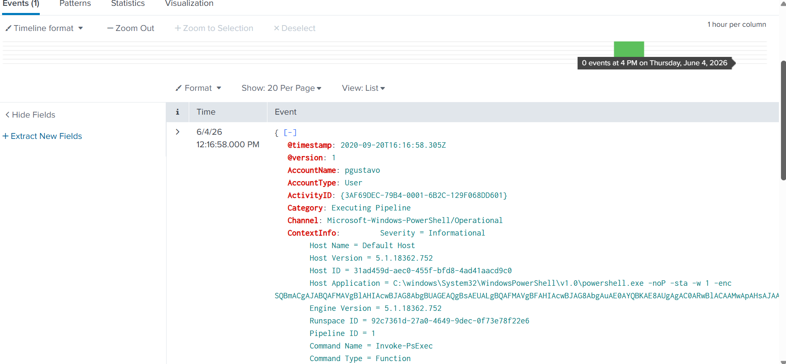

Finding:

The attacker leveraged PowerShell Empire tooling to execute commands remotely.

MITRE ATT&CK:

- T1021 – Remote Services

---

## 6. PowerShell Script Block Analysis

Script block logging revealed encoded PowerShell activity.

Evidence:

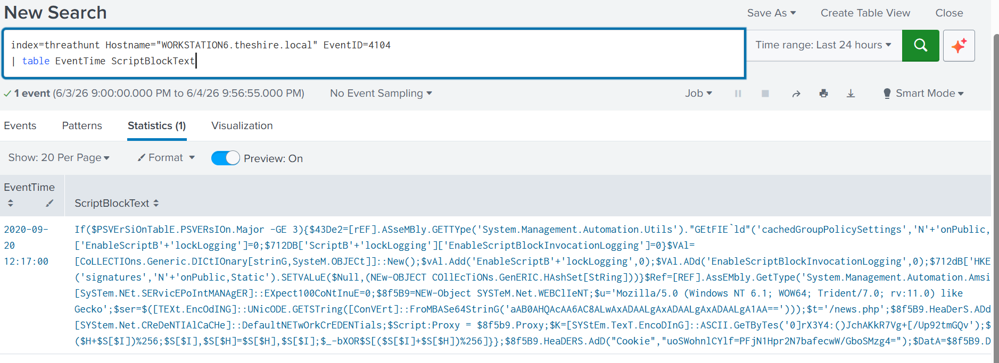

Finding:

Obfuscated PowerShell execution was identified.

MITRE ATT&CK:

- T1059.001 – PowerShell

---

## 7. AMSI Bypass Detection

Analysis revealed attempts to disable PowerShell security monitoring.

Evidence:

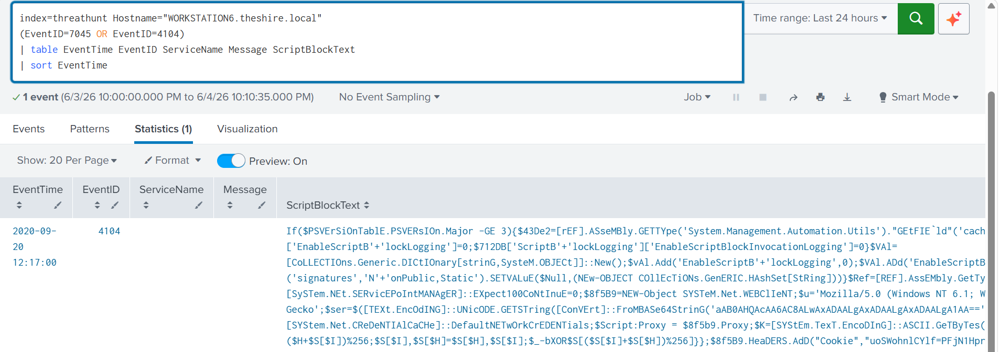

Finding:

AMSI bypass code was observed within PowerShell script blocks.

MITRE ATT&CK:

- T1562.001 – Impair Defenses

---

## 8. Malicious Service Installation

A suspicious service named "Updater" was installed.

Evidence:

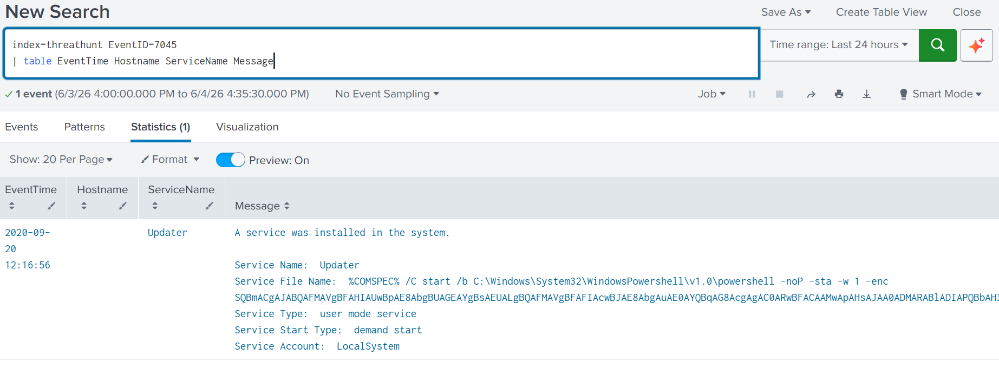

Finding:

The service launched encoded PowerShell commands and established persistence.

MITRE ATT&CK:

- T1543.003 – Windows Service

---

## 9. Registry Persistence

Registry modifications supporting persistence were identified.

Evidence:

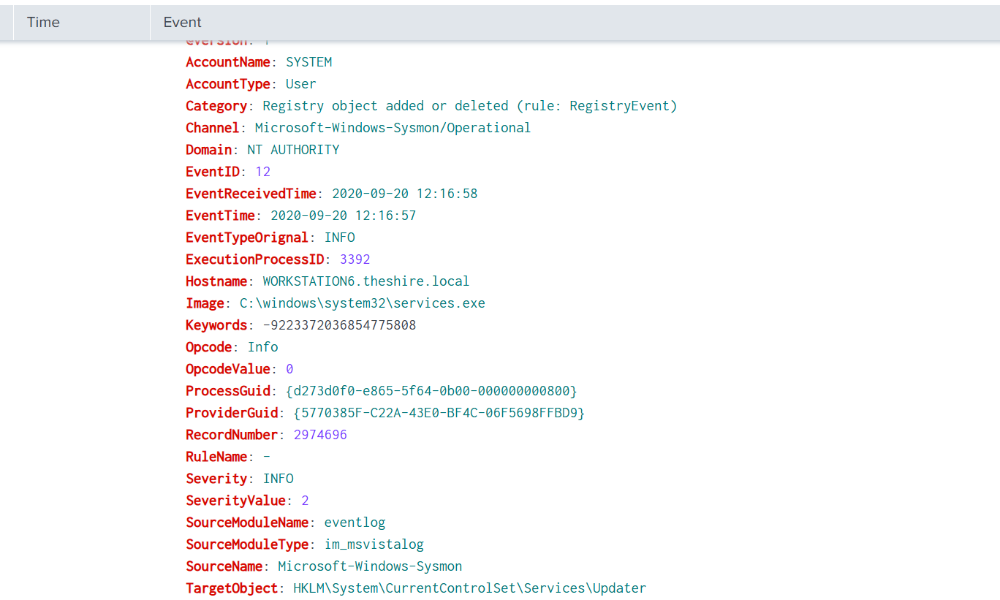

Finding:

Registry keys associated with the Updater service were created.

MITRE ATT&CK:

- T1547 – Registry Persistence

---

## 10. Event Correlation

Multiple event sources were correlated.

Evidence:

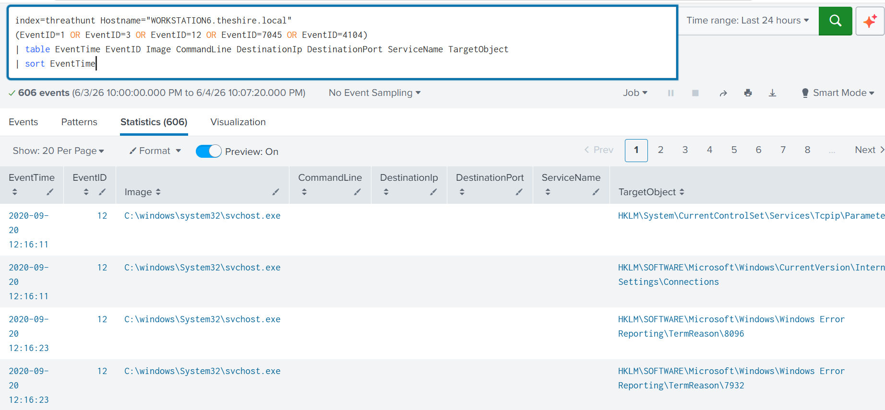

Finding:

PowerShell execution, service installation, and persistence events were directly linked.

---

## 11. Network Activity Analysis

Network connections initiated from suspicious processes were investigated.

Evidence:

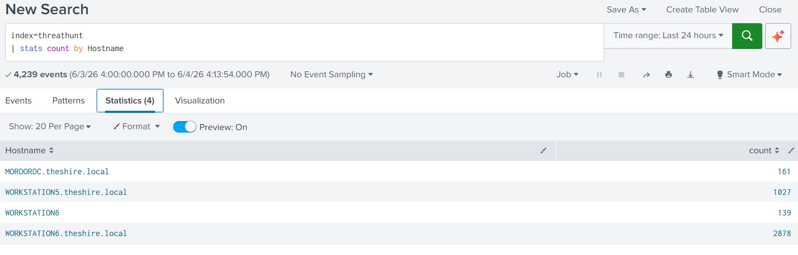

Finding:

PowerShell-generated network communication indicated command-and-control behavior.

MITRE ATT&CK:

- T1071 – Application Layer Protocol

---

# Attack Timeline

| Time | Activity |
|--------|------------|
| 12:16:38 | PowerShell execution begins |
| 12:16:56 | Invoke-PsExec observed |
| 12:16:57 | Updater service installed |
| 12:16:58 | Registry persistence established |
| 12:17:00 | AMSI bypass detected |
| 12:17:00+ | Network communication initiated |

---

# Incident Response Recommendations

## Containment

- Isolate affected endpoint from network.
- Disable malicious Updater service.
- Block identified command-and-control connections.

## Eradication

- Remove malicious services.
- Remove associated registry persistence entries.
- Reset compromised credentials.

## Recovery

- Rebuild or reimage affected system.
- Restore business operations.
- Conduct environment-wide hunting for similar indicators.

## Lessons Learned

- Enable PowerShell Script Block Logging.
- Enable Sysmon across all endpoints.
- Monitor Event ID 7045 service installations.
- Alert on AMSI bypass indicators.
- Monitor encoded PowerShell execution.

---

# Conclusion

The investigation successfully reconstructed a PowerShell Empire intrusion using Splunk and Windows telemetry. The attack involved PowerShell execution, defense evasion, persistence establishment, and network communication. Correlation of Sysmon and PowerShell logs enabled complete visibility into attacker actions and provided actionable incident response recommendations.
